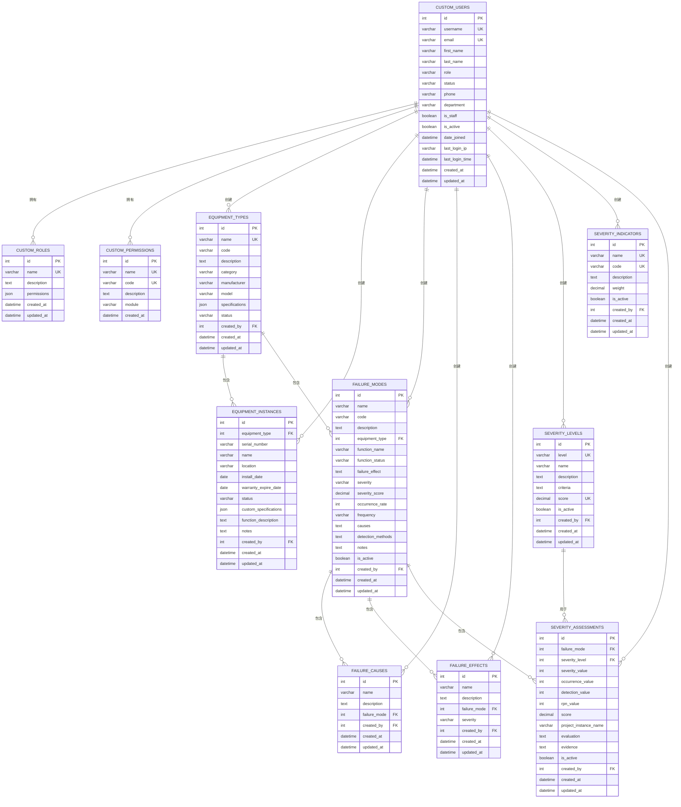
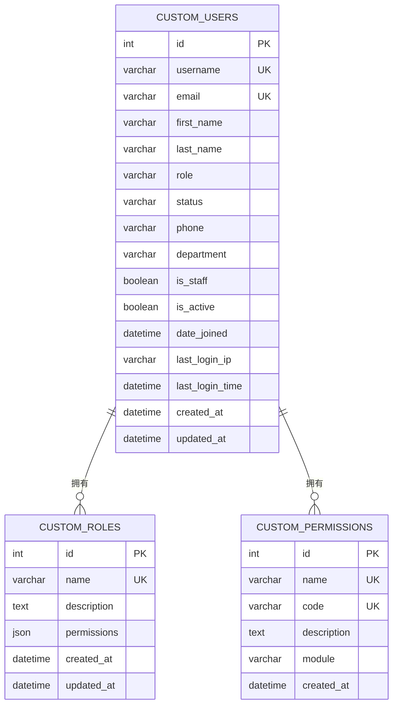
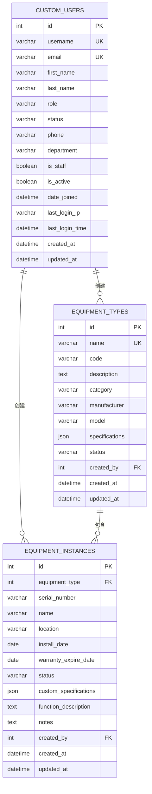
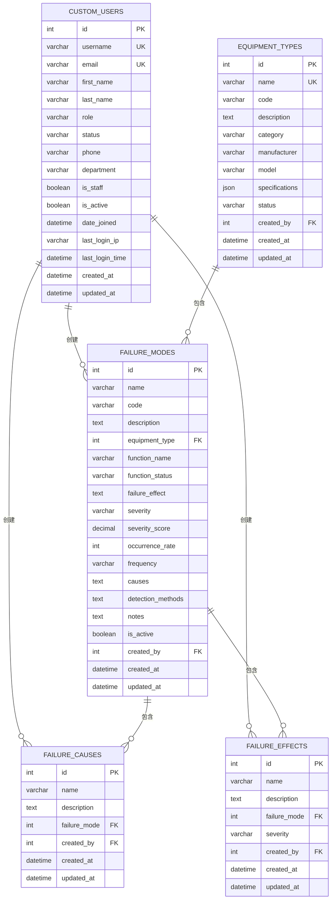
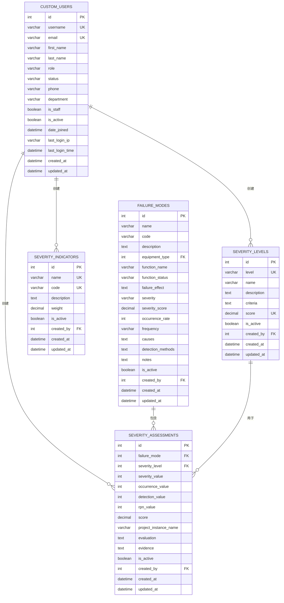

# FMECA系统数据库E-R图

## 1. 完整E-R图



---

## 2. 模块化E-R图

### 2.1 用户管理模块E-R图



**关系说明**：
- 一个用户可以拥有多个角色（多对多）
- 一个用户可以拥有多个权限（多对多）

---

### 2.2 设备管理模块E-R图



**关系说明**：
- 一个用户可以创建多个设备类型（一对多）
- 一个用户可以创建多个设备实例（一对多）
- 一个设备类型可以包含多个设备实例（一对多）

---

### 2.3 故障模式管理模块E-R图



**关系说明**：
- 一个设备类型可以包含多个故障模式（一对多）
- 一个故障模式可以包含多个故障原因（一对多）
- 一个故障模式可以包含多个故障影响（一对多）
- 用户可以创建故障模式、故障原因和故障影响（多对一）

---

### 2.4 严酷度管理模块E-R图



**关系说明**：
- 一个故障模式可以包含多个严酷度评定（一对多）
- 一个严酷度等级可以用于多个评定（一对多）
- 用户可以创建严酷度等级、严酷度指标和严酷度评定（多对一）

---

## 3. 表结构详细说明

### 3.1 custom_users（用户表）

| 字段名 | 类型 | 约束 | 说明 |
|--------|------|------|------|
| id | INT | PK, AUTO_INCREMENT | 主键 |
| username | VARCHAR(150) | UK, NOT NULL | 用户名 |
| email | VARCHAR(255) | UK, NOT NULL | 邮箱 |
| first_name | VARCHAR(150) | NULL | 名字 |
| last_name | VARCHAR(150) | NULL | 姓氏 |
| role | VARCHAR(20) | NOT NULL | 用户角色 |
| status | VARCHAR(20) | NOT NULL | 用户状态 |
| phone | VARCHAR(20) | NULL | 电话 |
| department | VARCHAR(100) | NULL | 部门 |
| is_staff | BOOLEAN | NOT NULL | 是否为员工 |
| is_active | BOOLEAN | NOT NULL | 是否活跃 |
| date_joined | DATETIME | NOT NULL | 加入日期 |
| last_login_ip | VARCHAR(45) | NULL | 最后登录IP |
| last_login_time | DATETIME | NULL | 最后登录时间 |
| created_at | DATETIME | NOT NULL | 创建时间 |
| updated_at | DATETIME | NOT NULL | 更新时间 |

**索引**：
- PRIMARY KEY (id)
- UNIQUE INDEX (username)
- UNIQUE INDEX (email)
- INDEX (role)
- INDEX (status)
- INDEX (is_active)

---

### 3.2 custom_roles（角色表）

| 字段名 | 类型 | 约束 | 说明 |
|--------|------|------|------|
| id | INT | PK, AUTO_INCREMENT | 主键 |
| name | VARCHAR(50) | UK, NOT NULL | 角色名称 |
| description | TEXT | NULL | 角色描述 |
| permissions | JSON | NULL | 权限配置 |
| created_at | DATETIME | NOT NULL | 创建时间 |
| updated_at | DATETIME | NOT NULL | 更新时间 |

**索引**：
- PRIMARY KEY (id)
- UNIQUE INDEX (name)

---

### 3.3 custom_permissions（权限表）

| 字段名 | 类型 | 约束 | 说明 |
|--------|------|------|------|
| id | INT | PK, AUTO_INCREMENT | 主键 |
| name | VARCHAR(100) | UK, NOT NULL | 权限名称 |
| code | VARCHAR(50) | UK, NOT NULL | 权限代码 |
| description | TEXT | NULL | 权限描述 |
| module | VARCHAR(50) | NOT NULL | 所属模块 |
| created_at | DATETIME | NOT NULL | 创建时间 |

**索引**：
- PRIMARY KEY (id)
- UNIQUE INDEX (name)
- UNIQUE INDEX (code)
- INDEX (module)

---

### 3.4 equipment_types（设备类型表）

| 字段名 | 类型 | 约束 | 说明 |
|--------|------|------|------|
| id | INT | PK, AUTO_INCREMENT | 主键 |
| name | VARCHAR(100) | UK, NOT NULL | 设备类型名称 |
| code | VARCHAR(50) | NULL | 设备类型编码 |
| description | TEXT | NULL | 设备类型描述 |
| category | VARCHAR(100) | NULL | 设备类别 |
| manufacturer | VARCHAR(200) | NULL | 制造商 |
| model | VARCHAR(100) | NULL | 型号 |
| specifications | JSON | NULL | 技术规格 |
| status | VARCHAR(20) | NOT NULL | 状态 |
| created_by | INT | FK → custom_users.id | 创建人 |
| created_at | DATETIME | NOT NULL | 创建时间 |
| updated_at | DATETIME | NOT NULL | 更新时间 |

**索引**：
- PRIMARY KEY (id)
- UNIQUE INDEX (name)
- INDEX (status)
- INDEX (created_by)
- INDEX (category)

---

### 3.5 equipment_instances（设备实例表）

| 字段名 | 类型 | 约束 | 说明 |
|--------|------|------|------|
| id | INT | PK, AUTO_INCREMENT | 主键 |
| equipment_type | INT | FK → equipment_types.id | 设备类型 |
| serial_number | VARCHAR(100) | NOT NULL | 序列号 |
| name | VARCHAR(200) | NOT NULL | 设备名称 |
| location | VARCHAR(200) | NULL | 安装位置 |
| install_date | DATE | NULL | 安装日期 |
| warranty_expire_date | DATE | NULL | 保修到期日期 |
| status | VARCHAR(20) | NOT NULL | 状态 |
| custom_specifications | JSON | NULL | 自定义规格 |
| function_description | TEXT | NULL | 功能描述 |
| notes | TEXT | NULL | 备注 |
| created_by | INT | FK → custom_users.id | 创建人 |
| created_at | DATETIME | NOT NULL | 创建时间 |
| updated_at | DATETIME | NOT NULL | 更新时间 |

**索引**：
- PRIMARY KEY (id)
- UNIQUE INDEX (equipment_type, serial_number)
- INDEX (equipment_type)
- INDEX (status)
- INDEX (created_by)
- INDEX (serial_number)

---

### 3.6 failure_modes（故障模式表）

| 字段名 | 类型 | 约束 | 说明 |
|--------|------|------|------|
| id | INT | PK, AUTO_INCREMENT | 主键 |
| name | VARCHAR(100) | NOT NULL | 故障模式名称 |
| code | VARCHAR(50) | NOT NULL | 故障模式编码 |
| description | TEXT | NULL | 故障模式描述 |
| equipment_type | INT | FK → equipment_types.id | 设备类型 |
| function_name | VARCHAR(100) | NOT NULL | 功能名称 |
| function_status | VARCHAR(1) | NOT NULL | 功能状态 |
| failure_effect | TEXT | NOT NULL | 故障影响 |
| severity | VARCHAR(1) | NOT NULL | 严重性等级 |
| severity_score | DECIMAL(5,2) | NOT NULL | 严重性分数 |
| occurrence_rate | INT | NOT NULL | 发生频率(%) |
| frequency | VARCHAR(50) | NULL | 发生频率描述 |
| causes | TEXT | NULL | 故障原因 |
| detection_methods | TEXT | NULL | 检测方法 |
| notes | TEXT | NULL | 备注 |
| is_active | BOOLEAN | NOT NULL | 是否启用 |
| created_by | INT | FK → custom_users.id | 创建人 |
| created_at | DATETIME | NOT NULL | 创建时间 |
| updated_at | DATETIME | NOT NULL | 更新时间 |

**索引**：
- PRIMARY KEY (id)
- INDEX (equipment_type)
- INDEX (severity)
- INDEX (is_active)
- INDEX (created_by)
- INDEX (code)

---

### 3.7 failure_causes（故障原因表）

| 字段名 | 类型 | 约束 | 说明 |
|--------|------|------|------|
| id | INT | PK, AUTO_INCREMENT | 主键 |
| name | VARCHAR(100) | NOT NULL | 故障原因名称 |
| description | TEXT | NULL | 故障原因描述 |
| failure_mode | INT | FK → failure_modes.id | 关联故障模式 |
| created_by | INT | FK → custom_users.id | 创建人 |
| created_at | DATETIME | NOT NULL | 创建时间 |
| updated_at | DATETIME | NOT NULL | 更新时间 |

**索引**：
- PRIMARY KEY (id)
- INDEX (failure_mode)
- INDEX (created_by)

---

### 3.8 failure_effects（故障影响表）

| 字段名 | 类型 | 约束 | 说明 |
|--------|------|------|------|
| id | INT | PK, AUTO_INCREMENT | 主键 |
| name | VARCHAR(100) | NOT NULL | 故障影响名称 |
| description | TEXT | NULL | 故障影响描述 |
| failure_mode | INT | FK → failure_modes.id | 关联故障模式 |
| severity | VARCHAR(1) | NOT NULL | 影响严重性 |
| created_by | INT | FK → custom_users.id | 创建人 |
| created_at | DATETIME | NOT NULL | 创建时间 |
| updated_at | DATETIME | NOT NULL | 更新时间 |

**索引**：
- PRIMARY KEY (id)
- INDEX (failure_mode)
- INDEX (severity)
- INDEX (created_by)

---

### 3.9 severity_levels（严酷度等级表）

| 字段名 | 类型 | 约束 | 说明 |
|--------|------|------|------|
| id | INT | PK, AUTO_INCREMENT | 主键 |
| level | VARCHAR(2) | UK, NOT NULL | 严酷度等级 |
| name | VARCHAR(50) | NOT NULL | 等级名称 |
| description | TEXT | NOT NULL | 等级描述 |
| criteria | TEXT | NOT NULL | 评定标准 |
| score | DECIMAL(5,2) | UK, NOT NULL | 等级分数 |
| is_active | BOOLEAN | NOT NULL | 是否启用 |
| created_by | INT | FK → custom_users.id | 创建人 |
| created_at | DATETIME | NOT NULL | 创建时间 |
| updated_at | DATETIME | NOT NULL | 更新时间 |

**索引**：
- PRIMARY KEY (id)
- UNIQUE INDEX (level)
- UNIQUE INDEX (score)
- INDEX (is_active)
- INDEX (created_by)

---

### 3.10 severity_indicators（严酷度指标表）

| 字段名 | 类型 | 约束 | 说明 |
|--------|------|------|------|
| id | INT | PK, AUTO_INCREMENT | 主键 |
| name | VARCHAR(100) | UK, NOT NULL | 指标名称 |
| code | VARCHAR(50) | UK, NOT NULL | 指标编码 |
| description | TEXT | NOT NULL | 指标描述 |
| weight | DECIMAL(5,2) | NOT NULL | 指标权重 |
| is_active | BOOLEAN | NOT NULL | 是否启用 |
| created_by | INT | FK → custom_users.id | 创建人 |
| created_at | DATETIME | NOT NULL | 创建时间 |
| updated_at | DATETIME | NOT NULL | 更新时间 |

**索引**：
- PRIMARY KEY (id)
- UNIQUE INDEX (name)
- UNIQUE INDEX (code)
- INDEX (is_active)
- INDEX (created_by)

---

### 3.11 severity_assessments（严酷度评定表）

| 字段名 | 类型 | 约束 | 说明 |
|--------|------|------|------|
| id | INT | PK, AUTO_INCREMENT | 主键 |
| failure_mode | INT | FK → failure_modes.id | 故障模式 |
| severity_level | INT | FK → severity_levels.id | 严酷度等级 |
| severity_value | INT | NOT NULL | 严酷度S |
| occurrence_value | INT | NOT NULL | 发生度O |
| detection_value | INT | NOT NULL | 检测度D |
| rpn_value | INT | NOT NULL | 风险优先数RPN |
| score | DECIMAL(5,2) | NOT NULL | 评定分数 |
| project_instance_name | VARCHAR(255) | NOT NULL | 项目实例名称 |
| evaluation | TEXT | NULL | 评定说明 |
| evidence | TEXT | NULL | 评定依据 |
| is_active | BOOLEAN | NOT NULL | 是否有效 |
| created_by | INT | FK → custom_users.id | 创建人 |
| created_at | DATETIME | NOT NULL | 创建时间 |
| updated_at | DATETIME | NOT NULL | 更新时间 |

**索引**：
- PRIMARY KEY (id)
- INDEX (failure_mode)
- INDEX (severity_level)
- INDEX (is_active)
- INDEX (created_by)
- INDEX (project_instance_name)

---

## 4. 关系矩阵

| 表1 | 表2 | 关系类型 | 说明 |
|------|------|----------|------|
| custom_users | custom_roles | 多对多 | 一个用户可以有多个角色 |
| custom_users | custom_permissions | 多对多 | 一个用户可以有多个权限 |
| custom_users | equipment_types | 一对多 | 一个用户可以创建多个设备类型 |
| custom_users | equipment_instances | 一对多 | 一个用户可以创建多个设备实例 |
| custom_users | failure_modes | 一对多 | 一个用户可以创建多个故障模式 |
| custom_users | failure_causes | 一对多 | 一个用户可以创建多个故障原因 |
| custom_users | failure_effects | 一对多 | 一个用户可以创建多个故障影响 |
| custom_users | severity_levels | 一对多 | 一个用户可以创建多个严酷度等级 |
| custom_users | severity_indicators | 一对多 | 一个用户可以创建多个严酷度指标 |
| custom_users | severity_assessments | 一对多 | 一个用户可以创建多个严酷度评定 |
| equipment_types | equipment_instances | 一对多 | 一个设备类型可以包含多个设备实例 |
| equipment_types | failure_modes | 一对多 | 一个设备类型可以包含多个故障模式 |
| failure_modes | failure_causes | 一对多 | 一个故障模式可以包含多个故障原因 |
| failure_modes | failure_effects | 一对多 | 一个故障模式可以包含多个故障影响 |
| failure_modes | severity_assessments | 一对多 | 一个故障模式可以包含多个严酷度评定 |
| severity_levels | severity_assessments | 一对多 | 一个严酷度等级可以用于多个评定 |

---

## 5. 数据完整性约束

### 5.1 主键约束（PK）
所有表都有自增主键 `id`

### 5.2 唯一约束（UK）
- custom_users.username
- custom_users.email
- custom_roles.name
- custom_permissions.name
- custom_permissions.code
- equipment_types.name
- equipment_instances.serial_number（与equipment_type联合唯一）
- severity_levels.level
- severity_levels.score
- severity_indicators.name
- severity_indicators.code

### 5.3 外键约束（FK）
- equipment_types.created_by → custom_users.id
- equipment_instances.equipment_type → equipment_types.id
- equipment_instances.created_by → custom_users.id
- failure_modes.equipment_type → equipment_types.id
- failure_modes.created_by → custom_users.id
- failure_causes.failure_mode → failure_modes.id
- failure_causes.created_by → custom_users.id
- failure_effects.failure_mode → failure_modes.id
- failure_effects.created_by → custom_users.id
- severity_levels.created_by → custom_users.id
- severity_indicators.created_by → custom_users.id
- severity_assessments.failure_mode → failure_modes.id
- severity_assessments.severity_level → severity_levels.id
- severity_assessments.created_by → custom_users.id

### 5.4 非空约束（NOT NULL）
关键字段都设置了 NOT NULL 约束，确保数据完整性

---

## 6. E-R图符号说明

### 6.1 实体符号
- `||`：一端（必填）
- `o{`：多端（可选）
- `||`：一端（必填）
- `|{`：多端（必填）

### 6.2 关系符号
- `||--o{`：一对多（多端可选）
- `||--|{`：一对多（多端必填）
- `||--||`：一对一（两端必填）
- `o{--o{`：多对多（两端可选）

### 6.3 字段符号
- `PK`：主键（Primary Key）
- `FK`：外键（Foreign Key）
- `UK`：唯一键（Unique Key）

---

## 7. 数据流图

### 7.1 用户管理数据流
```
用户注册/登录 → custom_users
分配角色 → custom_roles
分配权限 → custom_permissions
```

### 7.2 设备管理数据流
```
创建设备类型 → equipment_types
创建设备实例 → equipment_instances
关联设备类型 → equipment_types.id
```

### 7.3 故障模式管理数据流
```
创建故障模式 → failure_modes
关联设备类型 → equipment_types.id
添加故障原因 → failure_causes
添加故障影响 → failure_effects
```

### 7.4 严酷度管理数据流
```
创建严酷度等级 → severity_levels
创建严酷度指标 → severity_indicators
进行严酷度评定 → severity_assessments
关联故障模式 → failure_modes.id
关联严酷度等级 → severity_levels.id
```

---

## 8. 查询优化建议

### 8.1 常用查询索引
- custom_users.username（用户登录查询）
- custom_users.email（用户登录查询）
- equipment_types.status（按状态筛选）
- equipment_instances.equipment_type（按设备类型查询）
- equipment_instances.status（按状态筛选）
- failure_modes.equipment_type（按设备类型查询）
- failure_modes.is_active（查询启用的故障模式）
- severity_levels.is_active（查询启用的等级）
- severity_assessments.failure_mode（按故障模式查询）
- severity_assessments.severity_level（按等级查询）

### 8.2 复合索引建议
- failure_modes (equipment_type, is_active)
- equipment_instances (equipment_type, status)
- severity_assessments (failure_mode, is_active)

---

## 9. 数据库设计最佳实践

### 9.1 命名规范
- 表名：使用小写字母，单词间用下划线分隔
- 字段名：使用小写字母，单词间用下划线分隔
- 外键字段：使用关联表名_id 格式

### 9.2 数据类型选择
- 使用合适的数据类型，避免浪费存储空间
- 文本字段根据长度选择 VARCHAR 或 TEXT
- 数值字段根据范围选择 INT 或 DECIMAL

### 9.3 约束使用
- 合理使用主键、外键、唯一键约束
- 避免过度约束影响性能
- 在应用层和数据库层都进行数据验证

### 9.4 索引策略
- 为常用查询字段创建索引
- 避免过多索引影响写入性能
- 定期分析和优化索引使用情况

---

## 10. 总结

本E-R图设计遵循了数据库设计的最佳实践，具有以下特点：

1. **完整性**：覆盖了前四个模块的所有实体和关系
2. **规范性**：遵循第三范式，消除数据冗余
3. **可扩展性**：支持灵活的扩展和修改
4. **性能优化**：合理的索引策略提高查询效率
5. **数据完整性**：完善的约束保证数据质量
6. **可维护性**：清晰的命名和结构便于维护

这个E-R图为FMECA系统提供了坚实的数据库设计基础。